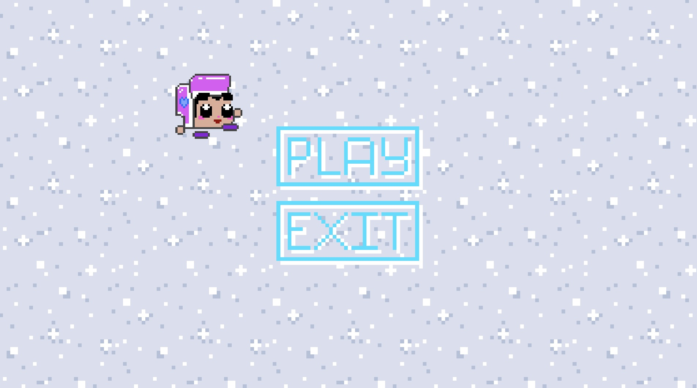
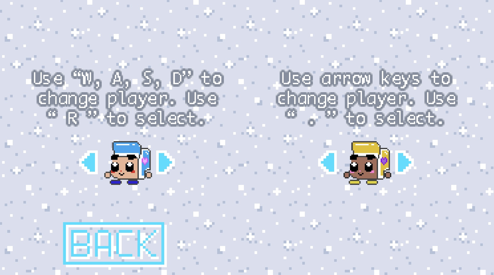
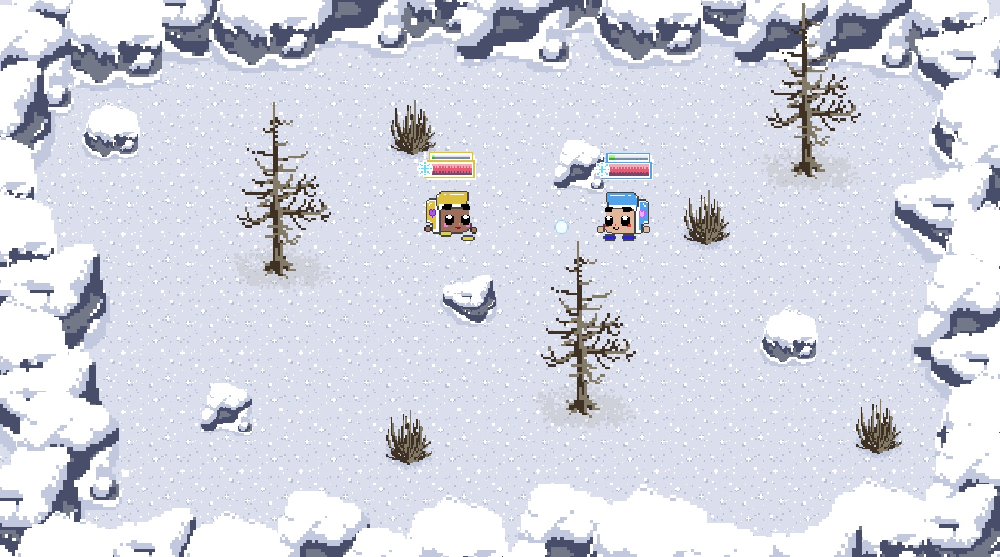

# Snowball
Snowball is a two player game, with WASD and arrow-keys as controls. Players can customize their color scheme, run around to collect snow, throw snow at each other, and try to stay warm. The first player to get cold loses!

Snowball is heavily inspired by [Maxime](https://github.com/maxdahan)'s Java edition with the same name. Check out his version of Snowball [here](https://github.com/MaxDahan/Snowball-Fight-Remake). Even more impressive is that his is exclusively written in Java with the JFrame library and no game engine, as well as featuring power-ups!

It took me about one month to complete everything. I made everything from scratch, including artwork, animation, game design, and code.

## How to play

Double click the "Snowball" file in this directory! The game requires two players, a keyboard and a mouse.

## Features
Check out the main menu! The only options are play or exit. You can also make the little character run around with arrow keys if you're bored!

Before you start, you get to choose your character and take a look at the instructions screens.

Run around to collect snow and charge up your snow bar! Shoot snow at players for them to get cold. Whoever stays warm longest wins!

The game is entirely built in C# and with the Unity game engine.

## Credits

Music by [RoccoW](https://soundcloud.com/roccow)
- Menu theme: ["Jam Jam Jam" said the Owner of the Shop](https://soundcloud.com/roccow/jam-jam-jam-said-the-owner-of)
- In-game theme: [17092017](https://soundcloud.com/roccow/f17092017-1)

Everything else by me.